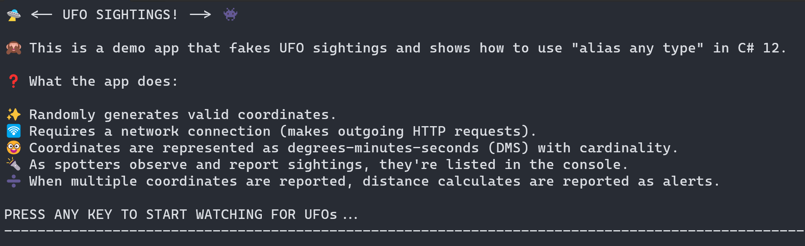
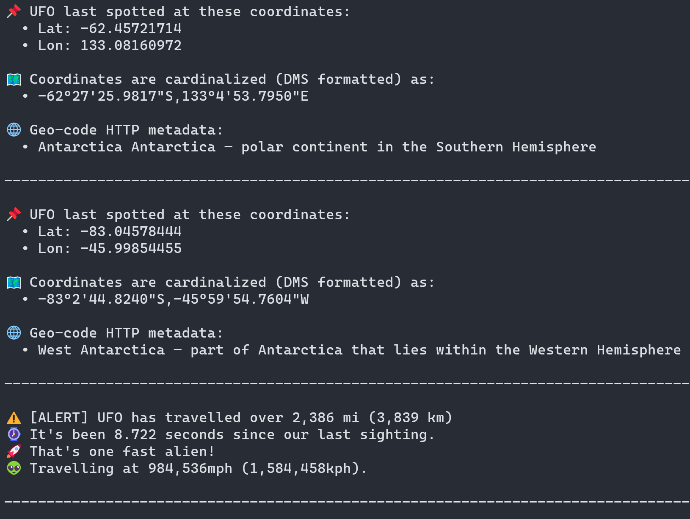

# C# 12: Alias Any Type

This is a demo app that shows how to use the "alias any type" feature in C# 12.

## 🛸 UFO Sightings

The app is a simple console app, that randomly generates valid coordinates (latitude and longitude), then using said coordinates retrieves geo-code metadata related to the coordinates. The coordinates are represented in degrees-minutes-seconds format (including cardinality). And when the app is running, distances between the generated coordinates are calculated and reported as UFO sightings.

## 🚀 Running the app

From the .NET CLI, use the following command to run the app:

```
dotnet run --project .\src\Alias.AnyType.csproj
```

When the app is starts, it will output to the console messaging similar to the following:



After reading the output, press any key to exit for the app to start watching for UFOs 👽.



Press <kbd>Ctrl</kbd> + <kbd>C</kbd> to exit the app.

## Explore "alias any type"

The advent of `global using` syntax in C# 10, and the introduction of `alias any type` in C# 12, has made it easier to work with types in C#. We're starting to see a common pattern emerge in modern .NET codebases where developers are defining a _GlobalUsings.cs_ file to encapsulate all (or most) `using` directives into a single file. This demo app follows this pattern:

```csharp
// Ensures that all types within these namespaces are globally available.
global using Alias.AnyType.Extensions;
global using Alias.AnyType.ResponseModels;

// Expose all static members of math.
global using static System.Math;

// Alias a coordinates object.
global using Coordinates = (double Latitude, double Longitude);

// Alias representation of degrees-minutes-second (DMS).
global using DMS = (int Degree, int Minute, double Second);

// Alias representation of various distances in different units of measure.
global using Distance = (double Meters, double Kilometers, double Miles);

// Alias a stream of coordinates represented as an async enumerable.
global using CoordinateStream = System.Collections.Generic.IAsyncEnumerable<
   ((double Latitude, double Longitude) Coordinates, Alias.AnyType.ResponseModels.GeoCode GeoCode)>;

// Alias the CTS, making it simply "Signal".
global using Signal = System.Threading.CancellationTokenSource;
```

- View the source: [`GlobalUsings.cs`](./src/GlobalUsings.cs)

There's several interesting things happening in the _GlobalUsings.cs_ file:

- **`global using` directives**: The `global using` directive is used to make the types within the specified namespaces globally available. This means that you don't have to include the `using` directive in every file that needs to use the types within the specified namespaces. This is a great way to reduce the amount of boilerplate code in your files.
- **`global using static` directive**: The `global using static` directive is used to make all the static members of a type globally available. This means that you don't have to include the `using static` directive in every file that needs to use the static members of the specified type.
- **`global using` alias**: The `global using` directive is used to create an alias for a type. This means that you can refer to the type using the alias instead of the full type name. This is a great way to make your code more readable and maintainable.

In addition to defining a _GlobalUsings.cs_ file, you can also globally define `using` directives in your project file. This is done by adding a `Usings` element to your project file. Here's an example of how you can define global `using` directives in your project file:

```xml
<Project Sdk="Microsoft.NET.Sdk">

  <PropertyGroup>
    <OutputType>Exe</OutputType>
    <TargetFramework>net8.0</TargetFramework>
    <ImplicitUsings>enable</ImplicitUsings>
    <Nullable>enable</Nullable>
  </PropertyGroup>

  <ItemGroup>
    <Using Include="System.Console" Static="true" />

    <Using Include="System.Net.Http.Json" />
    <Using Include="System.Runtime.CompilerServices" />
    <Using Include="System.Text" />
    <Using Include="System.Text.Json.Serialization" />
    <Using Include="System.Text.Json" />
  </ItemGroup>

</Project>
```

Be sure to set `ImplicitUsings` to `enable` to enable the global `using` directives in your project file.

The preceding project file defines an `ItemGroup` that contains various `Using` elements. Each `Using` element specifies a `using` directive that should be globally available in the project. As with the _GlobalUsings.cs_ file, this is a great way to reduce the amount of boilerplate code in your files. And you're able to express static usings, alias usings, and regular usings in the project file.

- View the source: [`Alias.AnyType.csproj`](./src/Alias.AnyType.csproj)
